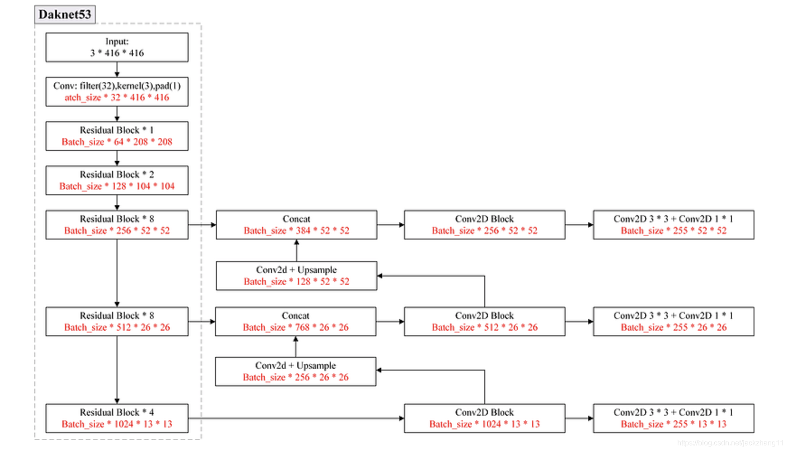
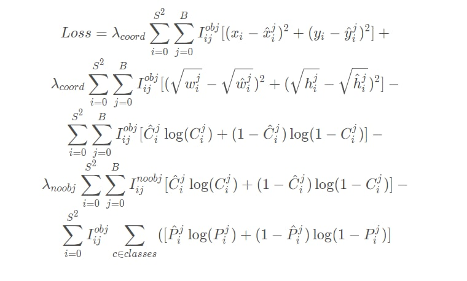
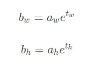

## YOLOv3的网络结构图

YOLOv3采用了Darknet53的backbone（采用了Resnet的残差结构），其输出为3张不同尺度的特征图（采用了SSD的思想)。特征图越小，每个grid cell对应的感受野越大，对应大目标的检测。

拿上图中右下角 ( 255 ∗ 13 ∗ 13 ) (255*13*13) (255∗13∗13)的特征图为例， 13 ∗ 13 是特征图大小，255可以拆分为 3 ∗ ( 4 + 1 + 80 ) ，3表示一个grid cell对应3个anchor，4表示anchor的中心坐标xy和宽高wh，1表示该anchor是否包含目标的置信度，80表示coco数据集的80个类别。

anchor的选择与yolov2一样，采用了kmeans的思想。不同的是这里的K值为9。聚类后，尺寸最大的三个框分配给特征图最小的（感受野大），用来检测大目标；最小的3个框分给特征图最大的（感受野小），用以检测小目标；剩下的3个框分给中间尺寸的特征图。

因此，yolov3的输出维度是 B a t c h ∗ 3 ∗ ( 4 + 1 + 80 ) ∗ ( 13 ∗ 13 + 26 ∗ 26 + 52 ∗ 52 ) 。

## YOLOv3损失函数的全貌

## 先理解anchor、置信度和类别概率

### 1.anchor box
### 1.1理解

anchor box其实就是从训练集的所有ground truth box中统计(使用k-means)出来的在训练集中最经常出现的几个box形状和尺寸。(**有助于模型快速收敛**)

anchor box其实就是对预测的对象范围进行约束，并加入了尺寸先验经验，从而实现多尺度学习的目的。

- **怎么在实际的模型中加入anchor box的先验经验呢？**

  最终负责预测grid cell中对象的box的最小单元是bounding box,那我们可以让一个grid  cell输出（预测）多个bounding box，然后每个bounding  box负责预测不同的形状不就行了？比如前面例子中的3个不同形状的anchor box，我们的一个grid  cell会输出3个参数相同的bounding box，第一个bounding box负责预测的形状与anchor box  1类似的box，其他两个bounding box依次类推。**作者在YOLOv3中取消了v2之前每个grid cell只负责预测一个对象的限制，也就是说grid cell中的三个bounding box都可以预测对象，当然他们应该对应不同的ground truth**。那么如何在**训练中**确定哪个bounding box负责某个ground truth呢？方法是求出每个grid cell中每个anchor box与ground truth  box的IOU(交并比)，IOU最大的anchor box对应的bounding box就负责预测该ground  truth，也就是对应的对象，后面还会提到负责预测的问题。
  
- **怎么告诉模型第一个bounding box负责预测的形状与anchor box 1类似，第二个bounding box负责预测的形状与anchor box 2类似？**

  YOLO的做法是**不让bounding box直接预测实际box的宽和高**(w,h)，而是将预测的宽和高分别与anchor box的宽和高绑定，这样不管一开始bounding box输出的(w,h)是怎样的，经过转化后都是与anchor  box的宽和高相关，这样经过很多次惩罚训练后，每个bounding box就知道自己该负责怎样形状的box预测了。这个**绑定的关系**是什么？就涉及到了anchor box的计算。
### 1.2计算

> 前提需要知道，
>
> c_x和c_y的坐标是(0,0) (0,1),(0,2),(0,3)…(0,13),(1,0),(1,1),(1,2),(1,3)…(1,13)等等
>
> bouding box的输出应当为：t_x和t_y和t_w和t_h
>
> 而真实的预测box应当是：b_x和b_y和b_w和b_h

刚刚说的**绑定关系**就是

> 其中，a_w和a_h为anchor box的宽和高，
>
> t_w和t_h为bounding box直接预测出的宽和高，
>
> b_w和b_h为转换后预测的实际宽和高，
>
> 这里的绑定只和w和h有关，与x，y无关，但是和grid_cell的归属有关

既然提到了最终预测的宽和高公式，那我们也就**直接带出最终预测输出的box中心坐标(bx,by)的计算公式**：
 前面提到过box中心坐标总是落在相应的grid cell中的，所以bounding box直接预测出的tx和ty也是相对grid cell来说的，**要想转换成最终输出的绝对坐标**，需要下面的转换公式：

> 那个符号是sigmoid

> p_w实际就是上面的a_w(anchor_w)

- 训练

  关于box参数的转换还有一点值得一提，作者在训练中并不是将t_x,t_y,t_w,t_h转换为b_x,b_y,b_w,b_h后与ground truth box的对应参数**求误差**，**而是使用上述公式的逆运算将ground truth box的参数转换为与t_x,t_y,t_w,t_h对应的数据进行误差运算**

  下图为对应的数据表达

  

### 2.置信度(confidence)

我懒了，一个公式就表明吧

### 3.对象条件类别概率(conditional class probabilities)

对象条件类别概率是一组概率的数组，数组的长度为当前模型检测的类别种类数量，**它的意义是当bounding box认为当前box中有对象时，要检测的所有类别中每种类别的概率**.
 其实这个和分类模型最后使用softmax函数输出的一组类别概率是类似的，只是二者存在两点不同：

- YOLO的对象类别概率中没有background一项，也不需要，因为对background的预测已经交给置信度了，所以它的输出是有条件的，那就是在置信度表示当前box有对象的前提下，所以条件概率的数学形式为Pr(classi∣Object);
- 分类模型中最后输出之前使用softmax求出每个类别的概率，也就是说各个类别之间是互斥的，而YOLOv3算法的每个类别概率是单独用逻辑回归函数(sigmoid函数)计算得出了，所以每个类别不必是互斥的，也就是说一个对象可以被预测出多个类别。这个想法其实是有一些YOLO9000的意思的，因为YOLOv3已经有9000类似的功能，不同只是不能像9000一样，同时使用分类数据集和对象检测数据集，且类别之间的词性是有从属关系的。

## 剖析损失函数

> 根据pytorch的代码，Yolov3的损失函数主要包括3个部分：
>
> - 对于正例，bounding box和ground true之间的位置坐标（x，y）和大小（w，h）的差异，采用MSE损失函数 『对应损失函数图中的1，2两行』
> - 对于正例和负例，计算置信度和真实之间的交叉熵 『对应损失函数图中的3，4两行』
> - 对于正例，计算80个类别维度与target的one-hot向量间的交叉熵损失 『对应损失函数图中的第5行』

**参数I_ij^obj**:

​        表示第i个grid_cell的第j个anchor box负责检测这个obj，如果负责则值==1，否则==0。

**参数I_ij^noobj**:

​        表示第i个grid_cell的第j个anchor box不负责检测这个obj，如果不负责则值==1，否则==0。

> 负责的含义指：那第 i i i个网格的 B B B个anchor box中与该对象的ground truth box的IOU在所有的anchor box（与一个grid cell中所有bounding box对应，COCO数据集中是9个）与ground truth box的IOU中最大，那它就负责预测这个对象，因为这个形状、尺寸最符合当前这个对象，此时就算负责检测这个obj
>
> > 但是代码里，只有max IOU才是正样本，而小于阈值IOU的则属于负样本

**参数置信度C_i^j**

​         训练中，hat_C_i^j表示真实值，hat_C_i^j的取值是由grid cell的bounding box有没有负责预测某个对象决定的。如果负责，那么值==1，否则==0.

> 如何确定某个grid cell的bounding box是否负责预测该grid cell中的对象：前面在说明anchor box的时候提到每个bounding box负责预测的形状是依据与其对应的anchor box相关的，那这个anchor box与该对象的ground truth box的IOU在所有的anchor box（与一个grid cell中所有bounding box对应，COCO数据集中是9个）与ground truth box的IOU中最大，那它就负责预测这个对象，因为这个形状、尺寸最符合当前这个对象，这时hat_C_i^j=1

**（其实我在想，为什么要加入负样本？？）**

> > （因为这个anchor box不负责目标，那么这个anchor box产生的bounding box的坐标，宽高，分类都不重要，也就不需要计算坐标，宽高，分类的损失函数，但是置信度仍然重要，因为置信度还可以表示这个anchor box产生的bounding box中并不包含对象，所以仍然需要计算置信度损失函数的。）
> > **(没懂)**

- 中心坐标误差

  实际上，网络输出的应当是 t_x 和 t_y ，然后通过 σ ( t x ) 和 σ ( t y ) ，再乘以步长，就映射到了 416 ∗ 416 大小的图上的目标了，所以在计算误差的时候，其实也是用的这一项 σ ( t x ) ∗ s t r i d e \和 σ ( t y ) ∗ s t r i d e 和真实目标经过resize到 416 ∗ 416 上的目标的大小，去计算误差。
  整个这一项表示的是：当第 i 个网格的第 j 个anchor box负责某一个真实目标时，那么这个anchor box所产生的bounding box就应该去和真实目标的box去比较，计算得到中心坐标误差。
  『**实际上我们产生一个疑问，sigmoid后再乘stride会不会有点奇怪，sigmoid不是线性的呀**』

- **置信度误差**

  损失函数分为两部分：有物体，没有物体，其中没有物体损失部分还增加了权重系数。添加权重系数的原因是，对于一幅图像，一般而言大部分内容是不包含待检测物体的，这样会导致没有物体的计算部分贡献会大于有物体的计算部分，这会导致网络倾向于预测单元格不含有物体。因此，我们要减少没有物体计算部分的贡献权重，比如取值为：0.5。

  > 另外，这里有个例外，当某个bounding box不负责对应grid cell中ground truth box的预测，但是又与该ground truth box的IOU大于设定的阈值时（论文中是0.5，darknet中针对COCO数据集使用的是0.7），忽略该bounding box所有输出的对loss的误差贡献，包括置信度误差。其他情况(负责某个对象即IOU最大的，不负责对象即IOU不是最大，而且IOU<0.5)要计算置信度误差。
  > **(kao,我对代码的理解是正确的)**

- 分类误差

  交叉熵，没什么好说的

-----时间7.8晚上，估计跑完代码后还要补充。。。。
